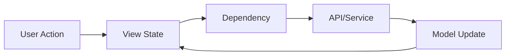

The PayphoneGo iOS app is built with modern SwiftUI patterns, emphasizing clean architecture, dependency injection, and reactive state management.

## Core architectural patterns

The app uses several key architectural patterns:

<Steps>
  <Step title="SwiftUI + Observable">
    Views are built with SwiftUI and state is managed using the `@Observable` macro for reactive updates
  </Step>
  
  <Step title="Dependency injection">
    Dependencies are injected using the [swift-dependencies](https://github.com/pointfreeco/swift-dependencies) library, making the app testable and modular
  </Step>
  
  <Step title="Navigation routing">
    Navigation is centralized using NavigationKit with type-safe destinations for tabs, sheets, pages, and full-screen presentations
  </Step>
  
  <Step title="Persistent storage">
    Local data persistence is handled through TinyStorage with property wrappers for simple key-value storage
  </Step>
</Steps>

## Application structure

```swift
PayphoneGoApp (App.swift:9)
└── ContentView (RootContainer.swift:8)
    ├── AppData lifecycle management
    ├── LocationManager environment
    └── NavigationContainer
        └── MainScreen
```

### Entry point

The app's entry point is defined in `App.swift:9`:

```swift App.swift
@main
struct PayphoneGoApp: App {
    init() {
        #if DEBUG
        Atlantis.start(hostName: "supernova.local.")
        NetworkLogger.enableProxy()
        #endif
    }

    var body: some Scene {
        WindowGroup {
            ContentView()
        }
    }
}
```

<Note>
In debug builds, network logging is automatically enabled via Atlantis and PulseProxy for development debugging.
</Note>

### Root container

The `ContentView` (RootContainer.swift:8) manages:

- **App lifecycle**: Responds to scene phase changes (active, background, inactive)
- **State initialization**: Loads `AppData` on app launch
- **Environment objects**: Provides `LocationManager` to the view hierarchy
- **Navigation**: Sets up the root navigation container

```swift RootContainer.swift
struct ContentView: View {
    @Environment(\.scenePhase) var scenePhase
    @Dependency(\.appData) private var appData
    
    @State private var locationManager = LocationManager()
    @State var router = Router(level: 0, identifierTab: nil)
    
    var body: some View {
        Group {
            content
                .task { await appData.load() }
                .onChange(of: scenePhase) { _, phase in
                    switch phase {
                        case .active: Task { await appData.foreground() }
                        case .background: Task { await appData.background() }
                        default: break
                    }
                }
        }
        .environment(locationManager)
    }
}
```

## Layer separation

The codebase is organized into clear layers:

| Layer | Purpose | Examples |
|-------|---------|----------|
| **Models** | Data structures and domain entities | `Phone.swift`, `Claim.swift` |
| **ViewModels** | Application state and business logic | `AppData.swift` |
| **Views** | UI components and screens | `MainScreen.swift`, `PhoneDetailSheet.swift` |
| **Support** | Infrastructure and utilities | `API.swift`, `LocationManager.swift`, `Logger.swift` |
| **Extensions** | Swift and SwiftUI extensions | `View+onShake.swift`, `TinyStorage+shared.swift` |

## Data flow

<Steps>
  <Step title="User interaction">
    User taps on a payphone marker in the map view
  </Step>
  
  <Step title="State update">
    `selectedPhoneId` state variable is updated via SwiftUI binding
  </Step>
  
  <Step title="API request">
    API client fetches phone details using `@Dependency(\.api)`
  </Step>
  
  <Step title="View update">
    SwiftUI automatically re-renders the detail sheet with new data
  </Step>
</Steps>



## Concurrency model

The app uses Swift's structured concurrency:

- **Main actor isolation**: UI components and managers are marked `@MainActor` to ensure thread safety
- **Async/await**: Network requests and lifecycle methods use async/await
- **Tasks**: Long-running operations are wrapped in `Task { }` blocks

```swift
@MainActor @Observable
final class AppData {
    var isReady = false
    
    func load() async {
        isReady = true
    }
}
```

<Warning>
All `@Observable` classes must be marked `@MainActor` to prevent data races and ensure UI updates happen on the main thread.
</Warning>

## Navigation architecture

Navigation is type-safe and centralized through the `Destination` enum (Destination.swift:5):

```swift Destination.swift
enum Destination: NavigationDestination {
    enum Tabs: String, TabRepresentable {
        case home
        case leaderboard
    }
    
    enum Pages: PageRepresentable {
        case comingSoon(title: String)
    }
    
    enum Sheets: Identifiable, SheetRepresentable {
        case browser(url: URL)
        case phoneDetail(phone: Phone)
    }
    
    enum FullScreen: Identifiable, FullScreenRepresentable {
        case browser(url: URL)
    }
}
```

This approach provides:
- Compile-time safety for navigation
- Associated values for passing data between screens
- Centralized control over presentation styles

## Next steps

<CardGroup cols={2}>
  <Card title="API client" icon="globe" href="/architecture/api-client">
    Learn about the API implementation
  </Card>
  <Card title="Location services" icon="location-dot" href="/architecture/location-services">
    Understand location management
  </Card>
  <Card title="State management" icon="database" href="/architecture/state-management">
    Explore app state patterns
  </Card>
</CardGroup>